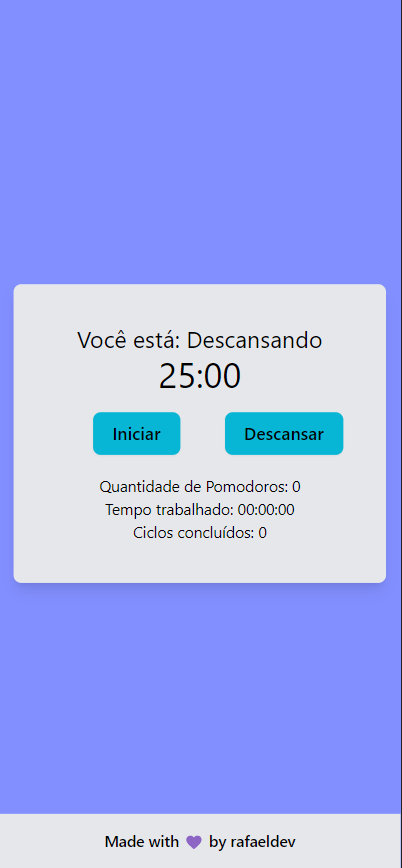
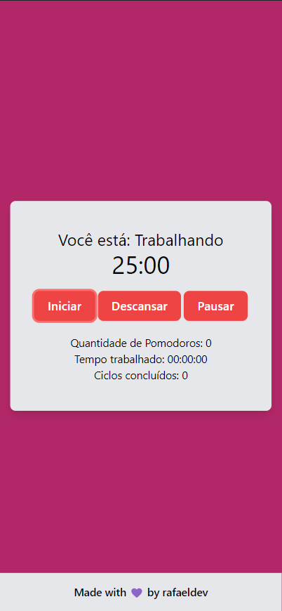

<h1 align="center">POMODORO APP</h1> 
<p align="center">Pomodoro Web App using Next.js, TypeScript and TailwindCSS</p>
<p align="center">Aplicação Web de Pomodoro usando Next.js, TypeScript e TailwindCSS</p>
<div align="center">
<a href="https://pomodoro-app-nine-rho.vercel.app/" target="_blank"></a>
</div>
<h1 align="center">PREVIEW</h1>
<div align="center">


</div>
<div align="center">


</div>

<br>

This is a [Next.js](https://nextjs.org/) project bootstrapped with [`create-next-app`](https://github.com/vercel/next.js/tree/canary/packages/create-next-app).

## Getting Started

First, run the development server:

```bash
pnpm run dev

npm run dev
# or
yarn dev
```

Open [http://localhost:3000](http://localhost:3000) with your browser to see the result.

You can start editing the page by modifying `pages/index.tsx`. The page auto-updates as you edit the file.


## Learn More

To learn more about Next.js, take a look at the following resources:

- [Next.js Documentation](https://nextjs.org/docs) - learn about Next.js features and API.
- [Learn Next.js](https://nextjs.org/learn) - an interactive Next.js tutorial.

You can check out [the Next.js GitHub repository](https://github.com/vercel/next.js/) - your feedback and contributions are welcome!

## Deploy on Vercel

The easiest way to deploy your Next.js app is to use the [Vercel Platform](https://vercel.com/new?utm_medium=default-template&filter=next.js&utm_source=create-next-app&utm_campaign=create-next-app-readme) from the creators of Next.js.

Check out our [Next.js deployment documentation](https://nextjs.org/docs/deployment) for more details.
